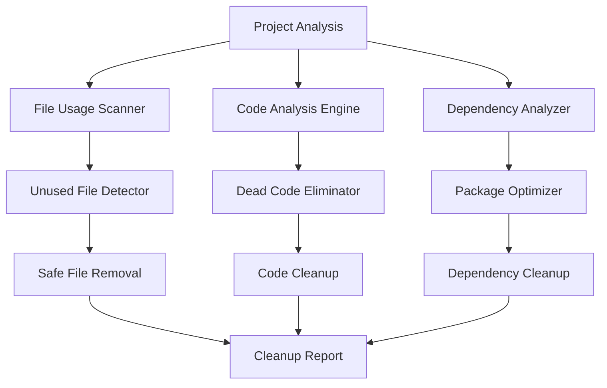
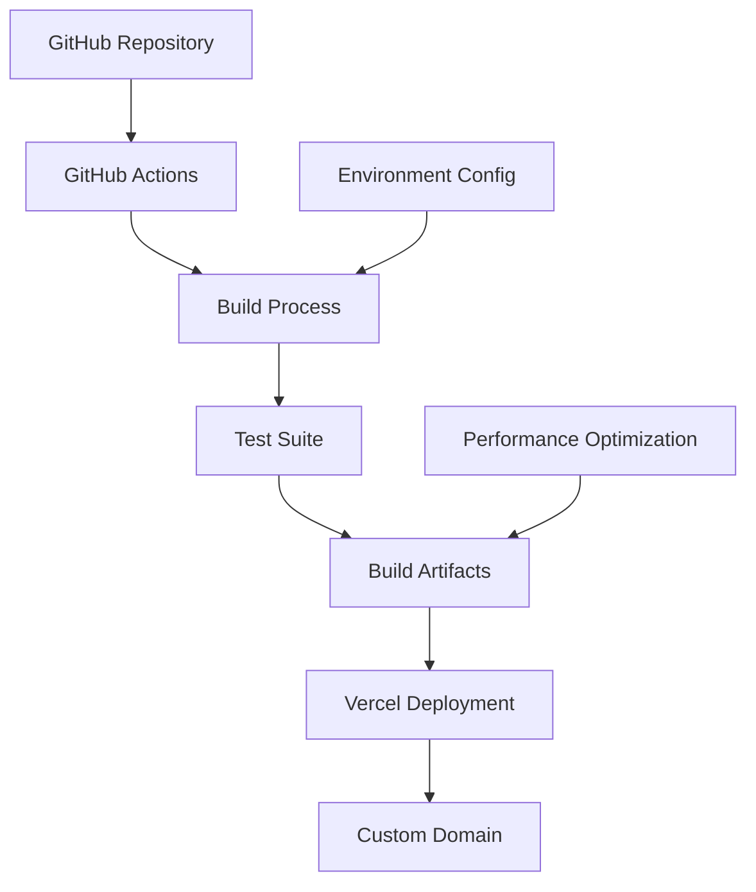

# Design Document

## Overview

This design outlines a comprehensive approach to cleaning up the React/TypeScript project and implementing advanced production features. The solution consists of two main phases: cleanup/optimization and CI/CD pipeline implementation. The project currently uses Vite, React 18, TypeScript, Tailwind CSS, and shadcn/ui components with a landing page structure.

## Architecture

### Phase 1: Cleanup and Optimization Architecture



### Phase 2: CI/CD Pipeline Architecture



## Components and Interfaces

### 1. Project Analyzer Component

**Purpose:** Scans the entire project to identify usage patterns and dependencies.

**Key Functions:**
- `scanFileUsage()`: Analyzes import/export relationships
- `detectUnusedFiles()`: Identifies files not referenced anywhere
- `analyzeCodeUsage()`: Finds unused imports, functions, and variables
- `checkDependencyUsage()`: Maps package.json dependencies to actual usage

**Interfaces:**
```typescript
interface FileUsageReport {
  filePath: string;
  isUsed: boolean;
  referencedBy: string[];
  exports: string[];
  imports: string[];
}

interface CodeAnalysisReport {
  unusedImports: string[];
  unusedVariables: string[];
  unusedFunctions: string[];
  deadCode: CodeBlock[];
}

interface DependencyReport {
  packageName: string;
  isUsed: boolean;
  usageLocations: string[];
  size: number;
}
```

### 2. Cleanup Engine Component

**Purpose:** Safely removes unused code and files while preserving functionality.

**Key Functions:**
- `removeUnusedFiles()`: Safely deletes unused files
- `cleanupCode()`: Removes unused imports and dead code
- `optimizeDependencies()`: Removes unused packages
- `validateChanges()`: Ensures application still works after cleanup

### 3. Build Optimization Component

**Purpose:** Configures production-ready build settings and optimizations.

**Key Functions:**
- `configureBundleOptimization()`: Sets up code splitting and tree shaking
- `setupCaching()`: Implements proper caching strategies
- `optimizeAssets()`: Compresses and optimizes static assets
- `generateBuildReport()`: Provides performance metrics

### 4. CI/CD Pipeline Component

**Purpose:** Automates deployment process with GitHub Actions and Vercel.

**Key Functions:**
- `setupGitHubActions()`: Creates workflow files
- `configureVercelDeployment()`: Sets up Vercel integration
- `setupEnvironments()`: Configures dev/staging/production environments
- `implementQualityGates()`: Adds testing and linting checks

## Data Models

### Project Configuration Model
```typescript
interface ProjectConfig {
  name: string;
  version: string;
  buildSettings: BuildSettings;
  deploymentSettings: DeploymentSettings;
  environments: Environment[];
}

interface BuildSettings {
  outputDir: string;
  optimizations: OptimizationSettings;
  bundleAnalysis: boolean;
}

interface DeploymentSettings {
  platform: 'vercel';
  customDomain?: string;
  environmentVariables: Record<string, string>;
}
```

### Cleanup Results Model
```typescript
interface CleanupResults {
  filesRemoved: string[];
  codeOptimizations: CodeOptimization[];
  dependenciesRemoved: string[];
  spaceSaved: number;
  buildSizeReduction: number;
}

interface CodeOptimization {
  file: string;
  type: 'unused-import' | 'dead-code' | 'unused-variable';
  linesRemoved: number;
}
```

## Error Handling

### File System Operations
- **Safe deletion**: Create backups before removing files
- **Rollback mechanism**: Ability to restore deleted files if issues arise
- **Validation checks**: Ensure application builds successfully after each cleanup step

### Build Process
- **Incremental validation**: Test build after each optimization step
- **Dependency conflict resolution**: Handle version conflicts during cleanup
- **Fallback strategies**: Restore previous state if build fails

### Deployment Pipeline
- **Deployment rollback**: Automatic rollback on deployment failure
- **Environment validation**: Verify all required environment variables
- **Health checks**: Post-deployment verification of application functionality

## Testing Strategy

### Unit Testing
- Test cleanup algorithms with mock project structures
- Validate file usage detection accuracy
- Test dependency analysis correctness

### Integration Testing
- End-to-end cleanup process testing
- Build pipeline validation
- Deployment process verification

### Performance Testing
- Bundle size analysis before/after cleanup
- Build time measurement
- Runtime performance validation

### Manual Testing Checkpoints
1. **Pre-cleanup verification**: Ensure application works correctly
2. **Post-cleanup validation**: Verify all functionality remains intact
3. **Deployment testing**: Test complete deployment pipeline
4. **Production verification**: Validate live site functionality

## Implementation Phases

### Phase 1: Analysis and Cleanup (Priority: High)
1. Implement project analyzer to scan current codebase
2. Identify unused files, code, and dependencies
3. Create safe cleanup mechanisms with rollback capability
4. Execute cleanup with validation at each step

### Phase 2: Build Optimization (Priority: High)
1. Configure Vite for optimal production builds
2. Implement code splitting and tree shaking
3. Set up asset optimization and caching
4. Add bundle analysis and performance monitoring

### Phase 3: CI/CD Pipeline (Priority: Medium)
1. Create GitHub Actions workflows
2. Set up Vercel integration with custom domain
3. Configure environment management
4. Implement quality gates and testing

### Phase 4: Monitoring and Maintenance (Priority: Low)
1. Set up performance monitoring
2. Create maintenance scripts for ongoing cleanup
3. Implement automated dependency updates
4. Add deployment notifications and alerts

## Technology Stack Decisions

### Current Stack Analysis
- **Frontend**: React 18 + TypeScript + Vite (✅ Keep - modern and efficient)
- **Styling**: Tailwind CSS + shadcn/ui (✅ Keep - well-integrated)
- **Build Tool**: Vite (✅ Keep - fast and optimized)
- **Routing**: React Router (✅ Keep - standard solution)

### Cleanup Tools
- **ESLint**: For detecting unused code and imports
- **TypeScript Compiler**: For unused variable detection
- **Custom analyzers**: For file usage and dependency analysis
- **Vite Bundle Analyzer**: For build optimization insights

### CI/CD Tools
- **GitHub Actions**: For automation pipeline
- **Vercel CLI**: For deployment management
- **Environment management**: Vercel environment variables

## Security Considerations

### Code Cleanup Security
- Validate that removed code doesn't contain security configurations
- Ensure environment variables and secrets are not accidentally removed
- Maintain audit trail of all cleanup operations

### Deployment Security
- Secure environment variable management
- Proper access controls for deployment pipeline
- HTTPS enforcement for custom domain
- Content Security Policy implementation